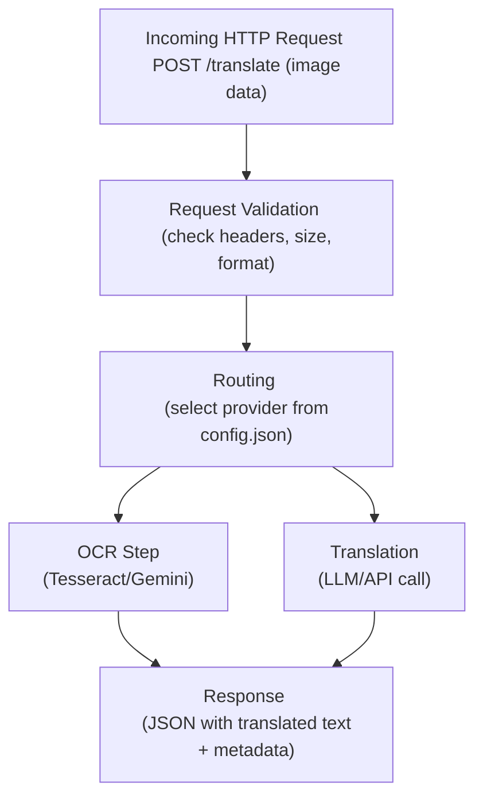

# Foundation & Understanding (Weeks 1–2)

## Primary Goals

1. **Internal mental model:** Be able to trace any request from receipt to response without looking up code.
2. **Pain point inventory:** Document UX issues, architectural smells, and technical debt before refactoring.
3. **Learning baseline:** Understand enough Python idioms here to recognize when something is "off."

## Success Criteria

By the end of Phase 0, you should be able to:

- Draw the request flow on paper from memory
- Locate and modify any config type without breaking the server
- Explain what each major file/module does in one sentence
- Confidently predict where a bug would manifest given a symptom

---

## Week 1: Codebase Reconnaissance

### Day 1–2: First Pass Reading

**Task:** Clone your fork and read files top-to-bottom in this order:

1. `README.md` — Get the high-level pitch
2. `INSTALL.md` — Understand dependencies and setup
3. `src/vgtranslate3/` directory — Read all `.py` files
4. Any config examples (`config_*.json`)
5. `tests/` — Skim what's tested vs. not tested
6. `pyproject.toml` and `requirements.txt` — Dependencies

**Deliverable:** A `PHASE0_NOTES.md` document with:

- One sentence describing each file/module's purpose
- A list of 5–10 terms/concepts you had to look up
- Your initial gut feelings on what feels clean vs. messy

**Cursor usage tip:** For any function/file you don't understand, highlight the code and ask:

> "Explain this function's purpose, inputs, outputs, and side effects. What's a realistic scenario where this would fail?"

Don't rush. Spend 30–60 minutes per file if needed. The goal is comprehension, not speed.

### Day 3–4: Trace the Request Lifecycle

**Task:** Manually trace an image request from arrival to translation completion.

Start at the server entry point (likely a Flask/FastAPI route handler or equivalent), then follow:

- How does the image get received?
- Where does OCR happen?
- Where does translation happen?
- How are errors handled at each stage?
- What gets returned to the client?

**Deliverable:** An `ARCHITECTURE_DRAFT.md` with:

- A text-based diagram of the request flow
- A table listing each major component, its responsibility, and dependencies
- Notes on where data transforms (e.g., "image bytes → PIL Image → base64 → JSON blob")
`
**Example flow sketch:**

### Day 5–7: Static Analysis

**Task:** Run the existing tests and examine coverage.

Even if you don't write new tests yet, run:

`python -m pytest --cov=src/ --cov-report=html`

Or whatever test runner the project uses. Look at:

- Which modules have zero test coverage?
- Which parts of the code aren't exercised?
- Are there obvious gaps (e.g., error handling paths)?

Also check:

- Static analysis warnings with `pylint` or `flake8`
- Type hints: are they present, partial, or absent?
- Import cycles or circular dependencies

**Deliverable:** Add a section to `PHASE0_NOTES.md` covering:

- Coverage % estimate by module
- List of untested critical paths
- Static analysis issues you noticed (even if not fixing yet)

---

## Week 2: Configuration & Integration Deep Dive

### Day 8–10: Config System Mapping

**Task:** Understand every config variant in detail.

Look at all `config_*.json` files and catalog:

- What provider does each support?
- What fields are common vs. unique?
- How does the code pick which config to load?
- What happens when a required field is missing?

**Deliverable:** A `CONFIG_SYSTEM.md` document with:

- A table mapping config files to providers and key fields
- A diagram showing how config selection happens at runtime
- A list of validation gaps (fields that aren't checked, ambiguous defaults)
- Three hypothetical misconfigurations and where the error would surface

**Why this matters:** From what I saw, the config system is the biggest UX friction point. Users need to manually copy, rename, and edit JSON files. Fixing this will be Phase 3, but understanding it thoroughly now prevents you from shooting yourself in the foot later.

### Day 11–12: RetroArch Integration Flow

**Task:** Understand how RetroArch talks to PGTranslate.

The docs mention RetroArch AI Service integration. Trace:

- What protocol/port does RetroArch use?
- What request format does it expect?
- What response format must PGTranslate return?
- Are there timing constraints (game translation needs to be fast)?

**Deliverable:** A `RETROARCH_INTEGRATION.md` note covering:

- Protocol details (HTTP, WebSocket, etc.)
- Expected request/response schemas
- Any latency notes or performance considerations

**Research tip:** If the code doesn't clarify this, search RetroArch AI Service documentation. This is external knowledge you'll need.

### Day 13–14: Compile Findings & Identify Pain Points

**Task:** Synthesize everything into an actionable inventory.

Review your notes from Weeks 1–2 and identify:

1. **UX pain points:** Things users struggle with (e.g., "must manually edit 10 JSON files")
2. **Architecture smells:** Design patterns that feel fragile (e.g., "if/else chain for provider routing")
3. **Technical debt:** Missing tests, unclear error messages, undocumented functions
4. **Quick wins:** Small fixes that would yield big UX gains

**Deliverable:** Final `PHASE0_SUMMARY.md` with:

- Executive summary (one paragraph on state of the project)
- Architecture diagram (refined from Week 1)
- Priority-ranked pain points with suggested remediation phases
- Personal learning goals checklist (Python concepts you encountered that you want to master)